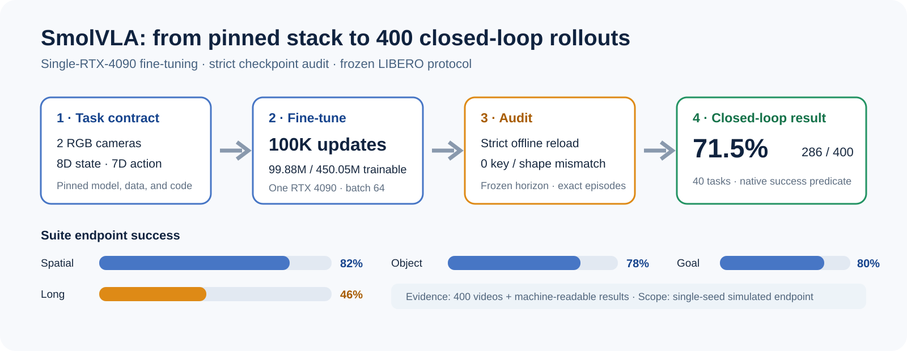

# SmolVLA Fine-Tuning and 400-Episode Evaluation on LIBERO

An end-to-end, single-RTX-4090 workflow for adapting a vision-language-action
policy and evaluating the frozen checkpoint in closed loop. The final policy
reached **71.5% endpoint success (286/400)** across all four LIBERO suites.

## 30-second overview

I took SmolVLA from a pinned pretrained checkpoint to a verified 100K-update
checkpoint and a frozen 400-episode benchmark. The work covered the parts that
often invalidate robot-learning results: observation/action interface checks,
checkpoint reload integrity, action-horizon alignment, exact episode coverage,
and task-level failure analysis.

| Evaluation scope                      |              Result |
| ------------------------------------- | ------------------: |
| LIBERO Spatial · 100 episodes         |           **82.0%** |
| LIBERO Object · 100 episodes          |           **78.0%** |
| LIBERO Goal · 100 episodes            |           **80.0%** |
| LIBERO Long · 100 episodes            |           **46.0%** |
| **Overall · 40 tasks / 400 episodes** | **71.5% (286/400)** |

This is a **single-seed, fixed-initial-state, simulated closed-loop result**.
It is not presented as SOTA, a multi-seed statistical estimate, or a
real-robot result.

## What I built

### 1. Reproducible single-GPU fine-tuning

- Pinned the LeRobot, LIBERO, dataset, base-policy, and released-anchor
  revisions in [`environment/stack_lock.json`](environment/stack_lock.json).
- Fine-tuned from the complete `lerobot/smolvla_base` policy for **100,000
  optimizer updates** at effective batch 64: **6.4M sample presentations**.
- Audited the runtime parameter set: **99.88M / 450.05M parameters trainable**;
  the complete 86.43M-parameter vision encoder remained frozen.
- Sustained a logged mean of **115.2 samples/s** with approximately 14.05 GB
  GPU memory use on one RTX 4090.

### 2. Runtime-contract and checkpoint integrity

The base checkpoint's static metadata described a 3-camera / 6D-state /
6D-action interface, while LIBERO requires two cameras, 8D state, and 7D
action. I traced how the official policy factory rebuilds task features and
applied the minimal frozen correction, `--policy.input_features=null`.

The final checkpoint passed:

- strict offline reload with **0 missing, 0 unexpected, and 0 shape-mismatched
  keys**;
- a real processed LIBERO batch at the final 2-camera / 8D-state / 7D-action
  contract;
- checkpoint, processor, tokenizer, optimizer, scheduler, RNG-state, and
  SHA256 integrity checks.

### 3. Closed-loop protocol that preserves benchmark meaning

- Evaluated four suites × ten tasks × ten fixed-init episodes: **400 rollouts**.
- Used native LIBERO success predicates, hard reset, relative control, seed 0,
  and a common `n_action_steps=1` controller horizon.
- Rejected faster vectorized W2/W4 candidates after they emitted 6/8 videos for
  five requested episodes and changed success sequences. The final benchmark
  retained exact W1 serial semantics instead of optimizing an invalid proxy.
- Preserved machine-readable results, the complete log, frozen commands/configs,
  and **400 rollout videos**; the final error scan found no OOM, NaN/Inf,
  traceback, processor/data/contract, or checkpoint-corruption errors.

## Representative successful rollouts

These four small clips show one successful episode from each suite. They are
qualitative examples, not the evidence used to calculate the success rate; the
reported number comes from all 400 audited episodes.

- [Spatial — task 0, episode 0](media/rollouts/spatial_task0_success.mp4)
- [Object — task 0, episode 0](media/rollouts/object_task0_success.mp4)
- [Goal — task 0, episode 2](media/rollouts/goal_task0_success.mp4)
- [Long-horizon — task 1, episode 0](media/rollouts/long_task1_success.mp4)

## Evidence, not just a headline number

- [Final 400-episode audit](docs/A5_FINAL_AUDIT_REPORT.md)
- [Checkpoint reload and parameter audit](docs/A4_FINALIZE_AUDIT.md)
- [Training dynamics](docs/A4_TRAINING_DYNAMICS.md)
- [Task-level endpoint comparison and failure matrix](docs/A2_A5_DESCRIPTIVE_COMPARISON.md)
- [Protocol amendments and their rationale](docs/AMENDMENTS.md)
- [Interview guide](docs/INTERVIEW_GUIDE.md)

The released anchor scored 66.75% and the final checkpoint scored 71.5% under
closely aligned endpoint settings. The **+4.75 percentage-point difference is
reported descriptively only**: the archived artifacts do not establish a
paired, multi-seed causal improvement.

## What this project demonstrates

- Vision-language-action policy adaptation using the current official stack
- Scientific debugging across model, dataset, processor, action, and evaluator
  interfaces
- Long-running GPU training, checkpoint recovery, and artifact provenance
- Closed-loop evaluation that treats scheduling and controller semantics as
  part of the experiment
- Honest failure boundaries: Long remains the weakest suite at 46%, and the
  current result remains simulation-only and single-seed

Large datasets, checkpoints, raw logs, caches, and the full video archive are
excluded from Git. The repository retains compact aggregate evidence and four
representative rollouts for review.
