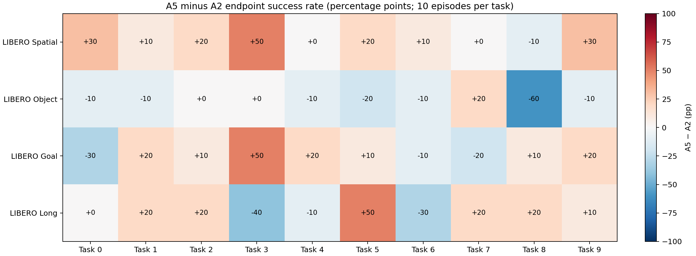

# A2 vs A5：任务级描述性 Endpoint 对照

## 目的与边界

本文件复用已完成的 A2 released-anchor 与 A5 final evaluation artifact，汇总 4 个 suite、每 suite 10 个 task、每 task 10 个 episode 的 endpoint success。它是冻结闭环协议下的单 seed 描述性对照，不是配对统计检验，也不构成因果归因。结果不应表述为“证明改进”或“显著改进”。

A2 和 A5 均使用同一 LIBERO task list、固定初始化、seed=0、hard reset、原生 success predicate、相对控制、双相机、8D state、7D action、W1 串行调度；A5 显式冻结 `n_action_steps=1`，A2 released anchor 的原生设置亦为 1。两次运行不能被当作跨 seed 的统计结论，且 artifact 未提供可用于逐 episode 配对检验的相同 init-state 序列证明。

## Suite-level endpoint 对照

| Suite | A2 success | A2 rate | A5 success | A5 rate | A5 − A2 (pp) |
| --- | ---: | ---: | ---: | ---: | ---: |
| LIBERO Spatial | 66/100 | 66.00% | 82/100 | 82.00% | +16.00 |
| LIBERO Object | 89/100 | 89.00% | 78/100 | 78.00% | -11.00 |
| LIBERO Goal | 72/100 | 72.00% | 80/100 | 80.00% | +8.00 |
| LIBERO Long | 40/100 | 40.00% | 46/100 | 46.00% | +6.00 |
| Overall | 267/400 | 66.75% | 286/400 | 71.50% | +4.75 |

## 40-task success/failure matrix

A2/A5 success 与 failure 分别是该 task 的 10 个 episode 计数。完整 CSV：`../results/A2_A5_TASK_SUCCESS_FAILURE_MATRIX.csv`。

| Suite | Task | A2 success | A2 failure | A2 rate | A5 success | A5 failure | A5 rate | Delta (pp) |
| --- | ---: | ---: | ---: | ---: | ---: | ---: | ---: | ---: |
| LIBERO Spatial | 0 | 6/10 | 4/10 | 60% | 9/10 | 1/10 | 90% | +30 |
| LIBERO Spatial | 1 | 8/10 | 2/10 | 80% | 9/10 | 1/10 | 90% | +10 |
| LIBERO Spatial | 2 | 7/10 | 3/10 | 70% | 9/10 | 1/10 | 90% | +20 |
| LIBERO Spatial | 3 | 5/10 | 5/10 | 50% | 10/10 | 0/10 | 100% | +50 |
| LIBERO Spatial | 4 | 8/10 | 2/10 | 80% | 8/10 | 2/10 | 80% | +0 |
| LIBERO Spatial | 5 | 3/10 | 7/10 | 30% | 5/10 | 5/10 | 50% | +20 |
| LIBERO Spatial | 6 | 8/10 | 2/10 | 80% | 9/10 | 1/10 | 90% | +10 |
| LIBERO Spatial | 7 | 9/10 | 1/10 | 90% | 9/10 | 1/10 | 90% | +0 |
| LIBERO Spatial | 8 | 7/10 | 3/10 | 70% | 6/10 | 4/10 | 60% | -10 |
| LIBERO Spatial | 9 | 5/10 | 5/10 | 50% | 8/10 | 2/10 | 80% | +30 |
| LIBERO Object | 0 | 9/10 | 1/10 | 90% | 8/10 | 2/10 | 80% | -10 |
| LIBERO Object | 1 | 8/10 | 2/10 | 80% | 7/10 | 3/10 | 70% | -10 |
| LIBERO Object | 2 | 8/10 | 2/10 | 80% | 8/10 | 2/10 | 80% | +0 |
| LIBERO Object | 3 | 10/10 | 0/10 | 100% | 10/10 | 0/10 | 100% | +0 |
| LIBERO Object | 4 | 10/10 | 0/10 | 100% | 9/10 | 1/10 | 90% | -10 |
| LIBERO Object | 5 | 7/10 | 3/10 | 70% | 5/10 | 5/10 | 50% | -20 |
| LIBERO Object | 6 | 10/10 | 0/10 | 100% | 9/10 | 1/10 | 90% | -10 |
| LIBERO Object | 7 | 8/10 | 2/10 | 80% | 10/10 | 0/10 | 100% | +20 |
| LIBERO Object | 8 | 10/10 | 0/10 | 100% | 4/10 | 6/10 | 40% | -60 |
| LIBERO Object | 9 | 9/10 | 1/10 | 90% | 8/10 | 2/10 | 80% | -10 |
| LIBERO Goal | 0 | 7/10 | 3/10 | 70% | 4/10 | 6/10 | 40% | -30 |
| LIBERO Goal | 1 | 8/10 | 2/10 | 80% | 10/10 | 0/10 | 100% | +20 |
| LIBERO Goal | 2 | 9/10 | 1/10 | 90% | 10/10 | 0/10 | 100% | +10 |
| LIBERO Goal | 3 | 3/10 | 7/10 | 30% | 8/10 | 2/10 | 80% | +50 |
| LIBERO Goal | 4 | 8/10 | 2/10 | 80% | 10/10 | 0/10 | 100% | +20 |
| LIBERO Goal | 5 | 9/10 | 1/10 | 90% | 10/10 | 0/10 | 100% | +10 |
| LIBERO Goal | 6 | 4/10 | 6/10 | 40% | 3/10 | 7/10 | 30% | -10 |
| LIBERO Goal | 7 | 10/10 | 0/10 | 100% | 8/10 | 2/10 | 80% | -20 |
| LIBERO Goal | 8 | 9/10 | 1/10 | 90% | 10/10 | 0/10 | 100% | +10 |
| LIBERO Goal | 9 | 5/10 | 5/10 | 50% | 7/10 | 3/10 | 70% | +20 |
| LIBERO Long | 0 | 0/10 | 10/10 | 0% | 0/10 | 10/10 | 0% | +0 |
| LIBERO Long | 1 | 3/10 | 7/10 | 30% | 5/10 | 5/10 | 50% | +20 |
| LIBERO Long | 2 | 4/10 | 6/10 | 40% | 6/10 | 4/10 | 60% | +20 |
| LIBERO Long | 3 | 9/10 | 1/10 | 90% | 5/10 | 5/10 | 50% | -40 |
| LIBERO Long | 4 | 2/10 | 8/10 | 20% | 1/10 | 9/10 | 10% | -10 |
| LIBERO Long | 5 | 5/10 | 5/10 | 50% | 10/10 | 0/10 | 100% | +50 |
| LIBERO Long | 6 | 9/10 | 1/10 | 90% | 6/10 | 4/10 | 60% | -30 |
| LIBERO Long | 7 | 1/10 | 9/10 | 10% | 3/10 | 7/10 | 30% | +20 |
| LIBERO Long | 8 | 1/10 | 9/10 | 10% | 3/10 | 7/10 | 30% | +20 |
| LIBERO Long | 9 | 6/10 | 4/10 | 60% | 7/10 | 3/10 | 70% | +10 |

## 描述性解读

总体 endpoint success 为 A2 66.75%（267/400）与 A5 71.50%（286/400），差值 +4.75 pp。40 个 task 中，21 个 task 的 A5 endpoint rate 更高、14 个更低、5 个相同。这只是同一冻结基准条件下两个 endpoint 的观测差异；它不隔离初始化、优化或其他潜在因素，也没有估计多 seed 不确定性。

