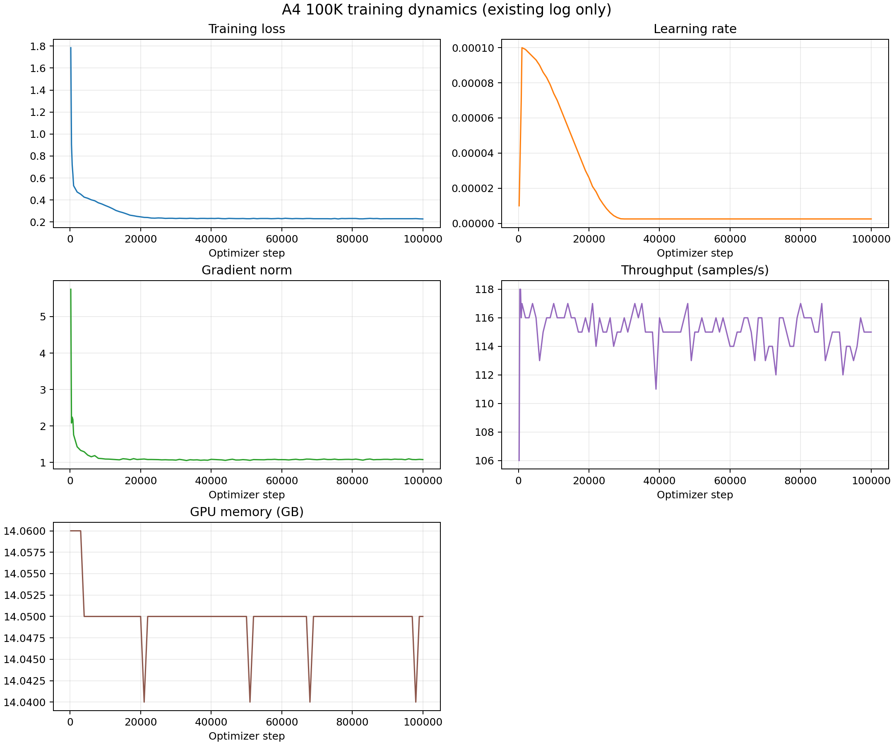

# A4 100K Training Dynamics

## 来源与边界

本分析只解析已完成 A4 训练的既有日志 `logs/A4_100k_final.log`，未启动训练、未加载或评估任何 checkpoint。解析到 104 个去重后的周期性记录，覆盖 step 200 至 100000。

## 汇总

| Metric | Min | Mean | Max |
| --- | ---: | ---: | ---: |
| Training loss | 0.228 | 0.285 | 1.785 |
| Learning rate | 2.50e-06 | — | 1.00e-04 |
| Gradient norm | 1.054 | 1.174 | 5.749 |
| Throughput (samples/s) | 106 | 115.2 | 118 |
| GPU memory (GB) | 14.04 | 14.05 | 14.06 |

日志中存在 loss、learning rate、gradient norm、throughput 和 memory 字段。曲线用于呈现已记录训练过程的数值稳定性；它们不替代独立验证指标，也不支持泛化能力结论。

